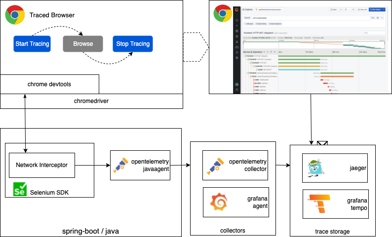

# opentelemetry browser

A traced chrome browser via Selenium Chrome Devtools reporting traces via grafana agent with otlp...  Own needs and ideas with something almost usable ;)

Opens a browser containing instructions how to start/stop a trace. Similar to .har file but on an opentelemetry backend.



## Quick start 

### Install chromedriver
Install chromedriver locally according to your browser version https://chromedriver.chromium.org/downloads
Default /usr/local/bin would be for MacOS. In that case run chromedriver executable once to have run permission. 
Repeat this on each driver update. Remember to download new driver if you upgrade the browser or use an auto managed chromedriver java code ;)

### Download java agent
```shell
wget https://github.com/open-telemetry/opentelemetry-java-instrumentation/releases/latest/download/opentelemetry-javaagent.jar
```

### Configure and run
- Edit jvmArguments inside pom.xml to set opentelemetry collector endpoints if it is other than localhost and default ports. 
```
-Dotel.exporter.otlp.endpoint=http://grafana-agent-traces.default.svc.cluster.local:4317
<!-- -Dotel.exporter.otlp.endpoint=http://localhost:4317 -->
-Dotel.metrics.exporter=none
<!-- -Dotel.metrics.exporter=otlp-->
```
- Run
```shell
mvn build
./mvnw spring-boot:run
```
Should opens a browser containing instructions how to start/stop a tracing.

---
## Long start ( The kubic way )

This section defines installing a grafana agent in local k8s to use as "opentelemetry collector" endpoint. 

- Install docker
- Install minikube

### Install grafana agent 
#### grafana agent traces
```shell
kubectl apply -f kubernetes/agent-traces.yaml
export USERNAME=<grafana cloud username>
export PASSWORD=<grafana cloud password>
kubectl apply -f kubernetes/agent-traces-configmap.yaml
```
Reach from local:
```shell
# otlp
kubectl port-forward svc/grafana-agent-traces --address=0.0.0.0 4317:4317 &

# optional to check metrics
# trace span metrics endpoint:
kubectl port-forward svc/grafana-agent-traces --address=0.0.0.0 8889:8889 &
# trace grafana agent own metrics endpoint:
kubectl port-forward svc/grafana-agent-traces 8080:8080

```


#### alternative grafana agent operator
  - Partially Follow https://grafana.com/docs/agent/latest/operator/getting-started/ 
  - Checkout grafana agent
  ```shell
  kubectl apply -f production/operator/crds
  ```
  - Install go
  ```shell
  go run ./cmd/agent-operator
  ```
  - 
