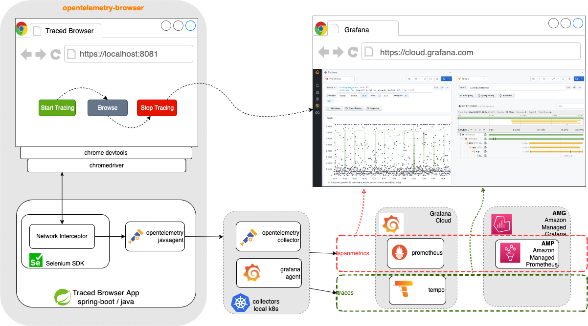

# opentelemetry browser

A traced chrome browser via Selenium Chrome Devtools reporting traces via grafana agent with otlp...  Own needs and ideas with something just usable ;)

Opens a browser containing instructions how to start/stop a trace. Similar to .har file but on an opentelemetry backend.

It enables a playground for those who are fairly new to tracing as well experts who know the value of http trafic on browser flows as an opentelemetry trace without configuring any instrumentation on top.



## Features
- Browser opentelemetry tracing without coding
- opentelemetry and grafana agent k8s deployment examples
- Spanmetrics processor embedded to collector pushes span metrics to  prometheus
- Pushes own Spring JVM metrics like disk, cpu, memory etc.
- Grafana Cloud and AMG/AMP backend integration.  We are hoping to see AMT - Amazon Managed Tempo soon ;)
## Quick start 

### Download java agent
```shell
wget https://github.com/open-telemetry/opentelemetry-java-instrumentation/releases/latest/download/opentelemetry-javaagent.jar
```

### Configure and run
- Edit jvmArguments inside pom.xml to set opentelemetry collector endpoints if it is other than localhost and default ports. 
```
-Dotel.exporter.otlp.endpoint=http://grafana-agent-traces.default.svc.cluster.local:4317
<!-- -Dotel.exporter.otlp.endpoint=http://localhost:4317 -->
-Dotel.metrics.exporter=none
<!-- -Dotel.metrics.exporter=otlp-->
```
- Run
```shell
mvn build
./mvnw spring-boot:run
```
Should opens a browser containing instructions how to start/stop a tracing.

---
## Slow start ( kubic way )

This section defines installing a grafana agent in local k8s to use as "opentelemetry collector" endpoint.

<link rel="stylesheet" href="https://use.fontawesome.com/releases/v5.6.1/css/all.css" integrity="sha384-gfdkjb5BdAXd+lj+gudLWI+BXq4IuLW5IT+brZEZsLFm++aCMlF1V92rMkPaX4PP" crossorigin="anonymous">


### Install opentelemetry collector
```shell
cd kubernetes/opentelemetry
# enter your grafana cloud info into yaml 
echo -n "<your user id>:<your api key>" | base64
# kubectl apply -f otel-collector.yaml
envsubst < otel-collector.yaml  | kubectl apply -f - 
kubectl rollout restart DaemonSet/otel-collector
ps -ef|grep 4317 |  awk '{print $2}' | xargs kill
kubectl port-forward svc/otel-collector --address=0.0.0.0 4317:4317 &

```

### Install opentelemetry operator
```shell
cd kubernetes/opentelemetry
kubectl apply -f https://github.com/cert-manager/cert-manager/releases/download/v1.8.0/cert-manager.yaml
kubectl apply -f https://github.com/open-telemetry/opentelemetry-operator/releases/latest/download/opentelemet

```


### Install grafana agent 
#### grafana agent traces
```shell
kubectl apply -f kubernetes/agent-traces.yaml
export USERNAME=<grafana cloud username>
export PASSWORD=<grafana cloud password>
kubectl apply -f kubernetes/agent-traces-configmap.yaml
kubectl rollout restart deployment/grafana-agent
```
Reach from local:
```shell
# otlp
kubectl port-forward svc/grafana-agent-traces --address=0.0.0.0 4317:4317 &

# optional to check metrics
# trace span metrics endpoint:
kubectl port-forward svc/grafana-agent-traces --address=0.0.0.0 8889:8889 &
# trace grafana agent own metrics endpoint:
kubectl port-forward svc/grafana-agent-traces 8080:8080

```


