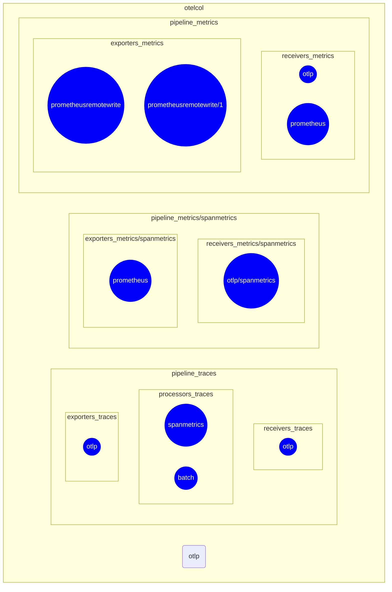

```mermaid
flowchart TD
classDef tclass fill:orange,stroke:orange,stroke-width:2px,color:#fff
classDef mclass fill:blue,stroke:blue,stroke-width:2px,color:#fff
subgraph otelcol
direction LR
subgraph pipeline_traces
subgraph receivers_traces
M0((otlp)):::mclass
end
subgraph processors_traces
M1((spanmetrics)):::mclass
M2((batch)):::mclass
end
subgraph exporters_traces
M3((otlp)):::mclass
end
end
subgraph pipeline_metrics/spanmetrics
subgraph receivers_metrics/spanmetrics
M4((otlp/spanmetrics)):::mclass
end
subgraph exporters_metrics/spanmetrics
M5((prometheus)):::mclass
end
end
subgraph pipeline_metrics
subgraph receivers_metrics
M6((otlp)):::mclass
M7((prometheus)):::mclass
end
subgraph exporters_metrics
M8((prometheusremotewrite)):::mclass
M9((prometheusremotewrite/1)):::mclass
end
end
te(otlp)
end
```