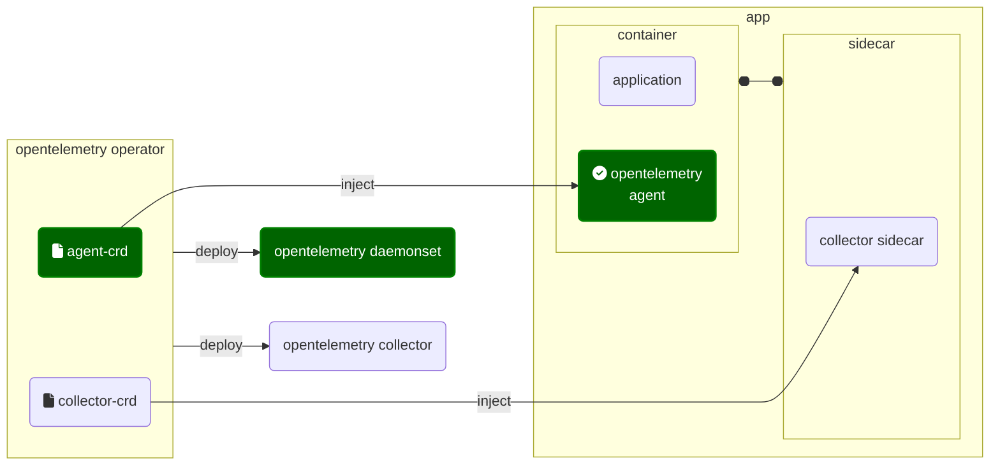

<link rel="stylesheet" href="https://cdnjs.cloudflare.com/ajax/libs/font-awesome/4.7.0/css/font-awesome.min.css">

```mermaid
flowchart LR
classDef green fill:green,stroke:green,stroke-width:2px,color:#fff
classDef dgreen fill:darkgreen,stroke:green,stroke-width:2px,color:#fff
subgraph oteloperator["opentelemetry operator"]
            direction LR 
            agent-crd("fa:fa-file agent-crd"):::dgreen
            collector-crd("fa:fa-file collector-crd") 
         
    end
    subgraph app
        subgraph container
            direction LR 
            application(application)
            otelagent("fa:fa-check-circle opentelemetry <br/>agent"):::dgreen
        end
        subgraph sidecar
            otelcol-sidecar(collector sidecar)
        end
    end

container o--o sidecar
   
  
 agent-crd -->|inject|otelagent
 collector-crd ---->|inject|otelcol-sidecar    
            
otelcol-daemonset( opentelemetry daemonset):::dgreen
otelcol( opentelemetry collector)
oteloperator -->|deploy| otelcol-daemonset & otelcol

```