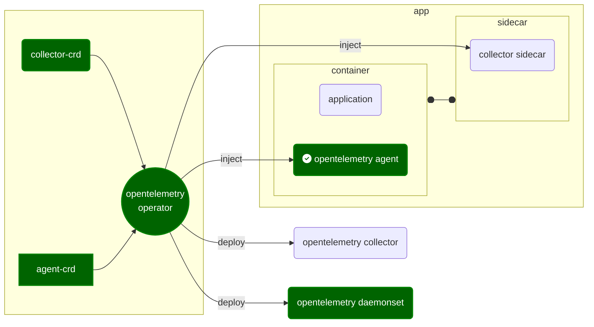

<link rel="stylesheet" href="https://use.fontawesome.com/releases/v6.1.1/css/all.css" integrity="sha384-gfdkjb5BdAXd+lj+gudLWI+BXq4IuLW5IT+brZEZsLFm++aCMlF1V92rMkPaX4PP" crossorigin="anonymous">

```mermaid
flowchart LR
classDef green fill:green,stroke:green,stroke-width:2px,color:#fff
classDef dgreen fill:darkgreen,stroke:green,stroke-width:2px,color:#fff
    subgraph otel-operator[" "]
            direction LR 

        oteloperator(( opentelemetry <br/> operator)):::dgreen 
        collector-crd( collector-crd):::dgreen -->oteloperator 
        agent-crd[ agent-crd]:::dgreen -->oteloperator
         
    end
    subgraph app
        subgraph container
            direction LR 
            application(application)
            otelagent(fa:fa-check-circle opentelemetry agent):::dgreen
        end
        subgraph sidecar
            otelcol-sidecar(collector sidecar)
        end
    end
    container o--o sidecar
    otelcol( opentelemetry collector)
    otelcol-daemonset( opentelemetry daemonset):::dgreen
    
     oteloperator -->|deploy| otelcol & otelcol-daemonset
     oteloperator -->|inject |otelcol-sidecar & otelagent
    
 

```