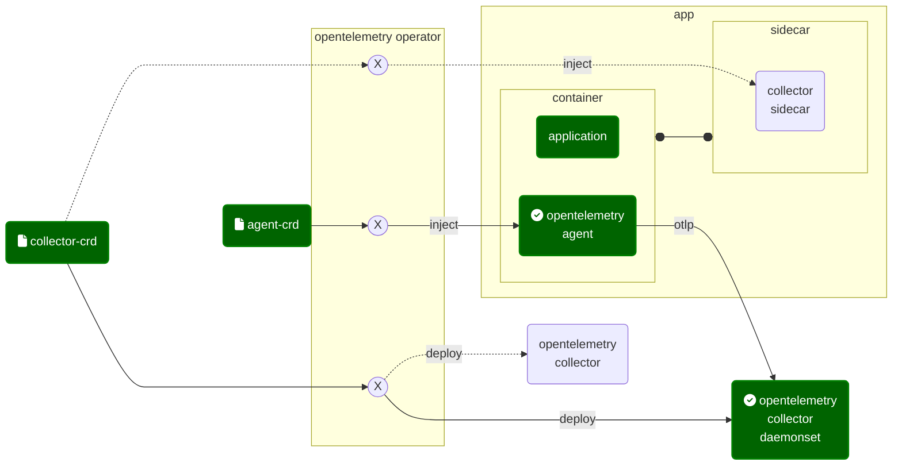

<link rel="stylesheet" href="https://cdnjs.cloudflare.com/ajax/libs/font-awesome/4.7.0/css/font-awesome.min.css">

### Install opentelemetry operator

#### Installation Architecture Options and goal



#### Get your hands dirty
```shell
cd kubernetes/opentelemetry
kubectl apply -f https://github.com/cert-manager/cert-manager/releases/download/v1.8.0/cert-manager.yaml
kubectl apply -f https://github.com/open-telemetry/opentelemetry-operator/releases/latest/download/opentelemetry-operator.yaml

kubectl port-forward svc/otel-collector --address=0.0.0.0 4317:4317 &

```