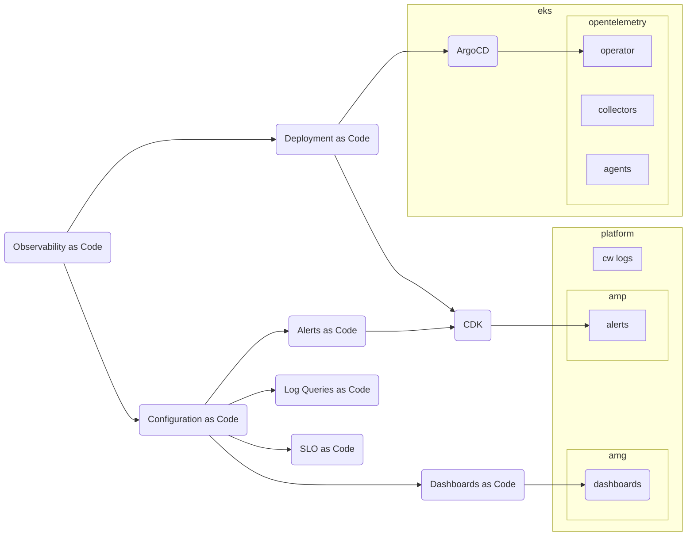

```mermaid
graph LR


OaC(Observability as Code)
DaC(Deployment as Code)
CaC(Configuration as Code)
DSHaC(Dashboards as Code)
AoC(Alerts as Code)
LQaC(Log Queries as Code)
SLOaC(SLO as Code)

dashboards(dashboards)
CDK(CDK)
ArgoCD(ArgoCD)


subgraph eks
    ArgoCD
    subgraph opentelemetry
        operator
        collectors
        agents
    end
end

subgraph platform
    subgraph amg
        dashboards
    end
    subgraph amp
        alerts
    end
    subgraph cloudwatch_logs[cw logs]
    end
end


OaC --> DaC
OaC --> CaC

DaC --> CDK
DaC --> ArgoCD

CaC --> DSHaC -->dashboards
CaC --> AoC 
CaC --> LQaC
CaC --> SLOaC

AoC -->CDK --> alerts

ArgoCD -->operator
```
