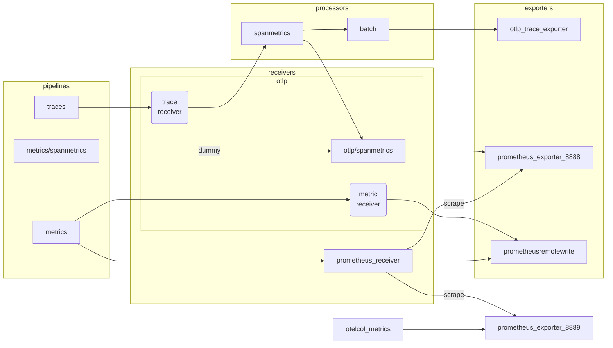

```mermaid

flowchart LR

classDef tclass fill:orange,stroke:orange,stroke-width:2px,color:#fff
classDef mclass fill:blue,stroke:blue,stroke-width:2px,color:#fff

    subgraph pipelines
 traces
 metrics/spanmetrics
metrics
    end 
   
    subgraph otlp
        otlp_trace_receiver("trace\nreceiver")
        otlp/spanmetrics
        otlp_metric_receiver("metric\nreceiver")
    end 
     
    subgraph receivers
        otlp
        
        prometheus_receiver
    end 
    
    
    subgraph processors
        spanmetrics
        batch
    end 
    
    subgraph exporters
    
        otlp_trace_exporter
        prometheus_exporter_8888
       
        prometheusremotewrite
    end 

 spanmetrics --> otlp/spanmetrics -->prometheus_exporter_8888
 traces -->  otlp_trace_receiver
 otlp_trace_receiver -->  spanmetrics --> batch -->otlp_trace_exporter
 
 metrics/spanmetrics -.->|dummy| otlp/spanmetrics
 
 
 metrics --> otlp_metric_receiver
  metrics  --> prometheus_receiver
 otlp_metric_receiver & prometheus_receiver -->  prometheusremotewrite
prometheus_receiver -->|scrape| prometheus_exporter_8888
prometheus_receiver -->|scrape| prometheus_exporter_8889
    otelcol_metrics --> prometheus_exporter_8889

```