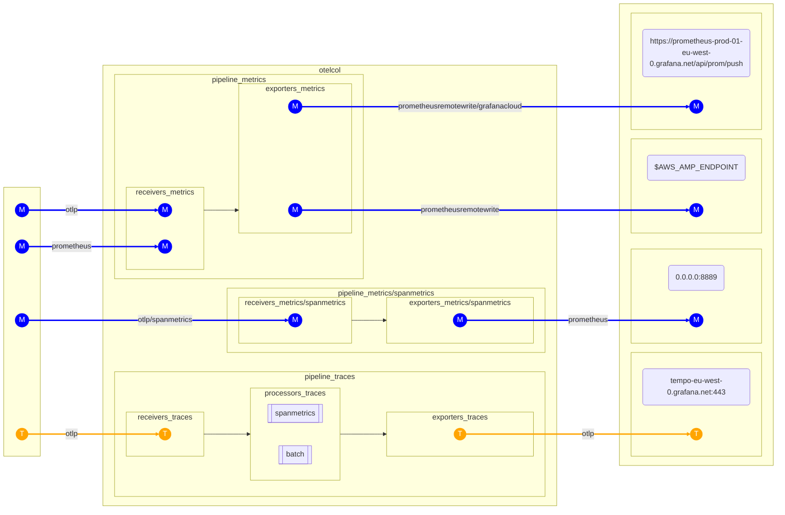

```mermaid 
flowchart LR
classDef tclass fill:orange,stroke:orange,stroke-width:2px,color:#fff
classDef mclass fill:blue,stroke:blue,stroke-width:2px,color:#fff
subgraph receiverNodes[" "]
direction LR
          otlp0((T)):::tclass
          otlp/spanmetrics6((M)):::mclass
          otlp10((M)):::mclass
          prometheus12((M)):::mclass

end
subgraph otelcol
direction LR
    subgraph pipeline_traces
  direction LR
      subgraph receivers_traces
      direction LR
          otlp1((T)):::tclass
      end

      subgraph processors_traces
      direction LR
          spanmetrics2[[spanmetrics]]
          batch3[[batch]]
      end

      subgraph exporters_traces
      direction LR
          otlp5((T)):::tclass
      end

  end

  subgraph pipeline_metrics/spanmetrics
  direction LR
      subgraph receivers_metrics/spanmetrics
      direction LR
          otlp/spanmetrics7((M)):::mclass
      end

      subgraph processors_traces
      direction LR
          spanmetrics2[[spanmetrics]]
          batch3[[batch]]
      end

      subgraph exporters_metrics/spanmetrics
      direction LR
          prometheus9((M)):::mclass
      end

  end

  subgraph pipeline_metrics
  direction LR
      subgraph receivers_metrics
      direction LR
          otlp11((M)):::mclass
          prometheus13((M)):::mclass
      end

      subgraph processors_traces
      direction LR
          spanmetrics2[[spanmetrics]]
          batch3[[batch]]
      end

      subgraph exporters_metrics
      direction LR
          prometheusremotewrite15((M)):::mclass
          prometheusremotewrite/grafanacloud17((M)):::mclass
      end

  end


end
subgraph exporterNodes[" "]
direction LR
          subgraph otlp4_sg[ ]
          otlp4_ep(tempo-eu-west-0.grafana.net:443)
          otlp4((T)):::tclass
         end

          subgraph prometheus8_sg[ ]
          prometheus8_ep(0.0.0.0:8889)
          prometheus8((M)):::mclass
         end

          subgraph prometheusremotewrite14_sg[ ]
          prometheusremotewrite14_ep($AWS_AMP_ENDPOINT)
          prometheusremotewrite14((M)):::mclass
         end

          subgraph prometheusremotewrite/grafanacloud16_sg[ ]
          prometheusremotewrite/grafanacloud16_ep(https://prometheus-prod-01-eu-west-0.grafana.net/api/prom/push)
          prometheusremotewrite/grafanacloud16((M)):::mclass
         end


end
otlp0-->|otlp|otlp1
        linkStyle 0 stroke:orange,stroke-width:3px

otlp5-->|otlp|otlp4
        linkStyle 1 stroke:orange,stroke-width:3px

receivers_traces-->processors_traces

processors_traces-->exporters_traces

otlp/spanmetrics6-->|otlp/spanmetrics|otlp/spanmetrics7
        linkStyle 4 stroke:blue,stroke-width:3px

prometheus9-->|prometheus|prometheus8
        linkStyle 5 stroke:blue,stroke-width:3px

receivers_metrics/spanmetrics-->exporters_metrics/spanmetrics

otlp10-->|otlp|otlp11
        linkStyle 7 stroke:blue,stroke-width:3px

prometheus12-->|prometheus|prometheus13
        linkStyle 8 stroke:blue,stroke-width:3px

prometheusremotewrite15-->|prometheusremotewrite|prometheusremotewrite14
        linkStyle 9 stroke:blue,stroke-width:3px

prometheusremotewrite/grafanacloud17-->|prometheusremotewrite/grafanacloud|prometheusremotewrite/grafanacloud16
        linkStyle 10 stroke:blue,stroke-width:3px

receivers_metrics-->exporters_metrics


```