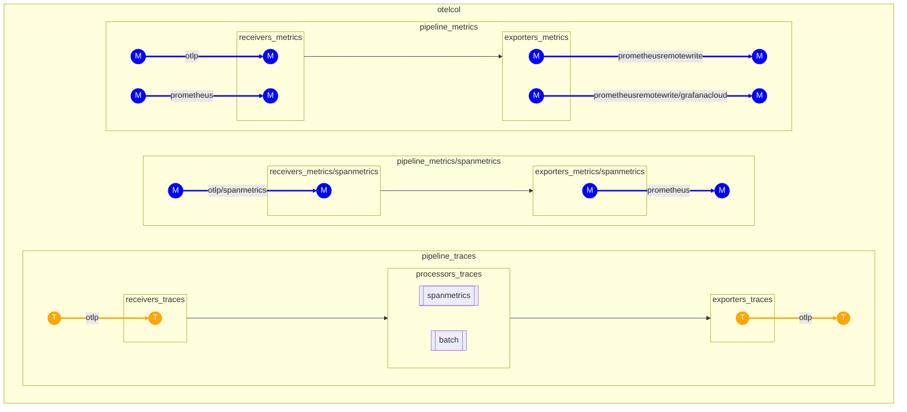

```mermaid
flowchart TD
classDef tclass fill:orange,stroke:orange,stroke-width:2px,color:#fff
classDef mclass fill:blue,stroke:blue,stroke-width:2px,color:#fff
subgraph otelcol
direction LR
  subgraph pipeline_traces
  direction LR
      subgraph receivers_traces
      direction LR
          otlp1((T)):::tclass
      end
      otlp0((T)):::tclass-->|otlp|otlp1((T)):::tclass
        linkStyle 0 stroke:orange,stroke-width:3px
      subgraph processors_traces
      direction LR
          spanmetrics2[[spanmetrics]]
          batch3[[batch]]
      end
      subgraph exporters_traces
      direction LR
          otlp5((T)):::tclass
      end
      otlp5((T)):::tclass-->|otlp|otlp4((T)):::tclass
        linkStyle 1 stroke:orange,stroke-width:3px
  receivers_traces----->processors_traces----->exporters_traces
  end
  subgraph pipeline_metrics/spanmetrics
  direction LR
      subgraph receivers_metrics/spanmetrics
      direction LR
          otlp/spanmetrics7((M)):::mclass
      end
      otlp/spanmetrics6((M)):::mclass-->|otlp/spanmetrics|otlp/spanmetrics7((M)):::mclass
        linkStyle 4 stroke:blue,stroke-width:3px
      subgraph exporters_metrics/spanmetrics
      direction LR
          prometheus9((M)):::mclass
      end
      prometheus9((M)):::mclass-->|prometheus|prometheus8((M)):::mclass
        linkStyle 5 stroke:blue,stroke-width:3px
  receivers_metrics/spanmetrics----->exporters_metrics/spanmetrics
  end
  subgraph pipeline_metrics
  direction LR
      subgraph receivers_metrics
      direction LR
          otlp11((M)):::mclass
          prometheus13((M)):::mclass
      end
      otlp10((M)):::mclass-->|otlp|otlp11((M)):::mclass
        linkStyle 7 stroke:blue,stroke-width:3px
prometheus12((M)):::mclass-->|prometheus|prometheus13((M)):::mclass
        linkStyle 8 stroke:blue,stroke-width:3px
      subgraph exporters_metrics
      direction LR
          prometheusremotewrite15((M)):::mclass
          prometheusremotewrite/grafanacloud17((M)):::mclass
      end
      prometheusremotewrite15((M)):::mclass-->|prometheusremotewrite|prometheusremotewrite14((M)):::mclass
        linkStyle 9 stroke:blue,stroke-width:3px
prometheusremotewrite/grafanacloud17((M)):::mclass-->|prometheusremotewrite/grafanacloud|prometheusremotewrite/grafanacloud16((M)):::mclass
        linkStyle 10 stroke:blue,stroke-width:3px
  receivers_metrics----->exporters_metrics
  end
end
```