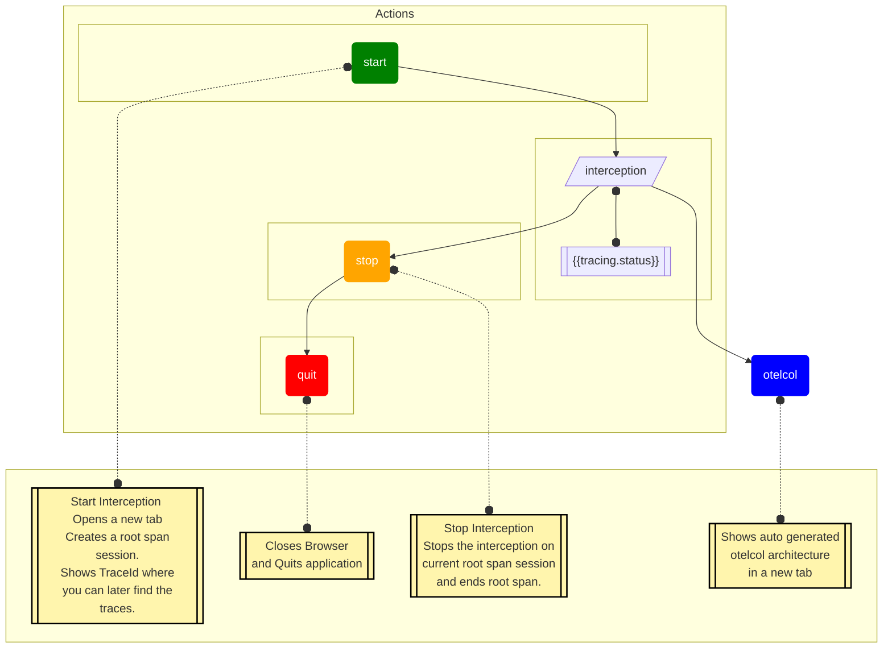

# opentelemetry-browser cockpit

```mermaid
flowchart TD
direction LR
classDef noteclass fill:#fff5ad,stroke:black,stroke-width:2px,color:#333
classDef blueclass fill:blue,stroke:blue,stroke-width:2px,color:#fff
classDef greenclass fill:green,stroke:green,stroke-width:2px,color:#fff
classDef orangeclass fill:orange,stroke:orange,stroke-width:2px,color:#fff
classDef redclass fill:red,stroke:red,stroke-width:2px,color:#fff

subgraph Actions
direction LR

    subgraph startsg[" "]
    
        start(start):::greenclass
    end
    
    subgraph interceptsg[" "]
    interception[/interception/]:::activeColorClass o--o
    tracingstatus[["{{tracing.status}}"]]
    end
    
    subgraph stopsg[" "]
        stop(stop):::orangeclass
    end
    
    subgraph quitsg[" "]
        quit(quit):::redclass
        
    end
end
    
subgraph descriptionsg[" "]
 
    startdesc[["Start Interception <br/> Opens a new tab <br/> Creates a root span session.<br/> Shows TraceId where <br/> you can later find the traces. "]]:::noteclass
    quitdesc[["Closes Browser <br/>and Quits application"]]:::noteclass
    stopdesc[["Stop Interception <br/> Stops the interception on <br/>current root span session <br/> and ends root span."]]:::noteclass
    otelcoldesc[["Shows auto generated<br/> otelcol architecture <br/>in a new tab"]]:::noteclass
end

start-->interception-->stop-->quit
interception-->otelcol(otelcol):::blueclass
start o-.-o startdesc
stop o-.-o stopdesc
quit o-.-o quitdesc
otelcol o-.-o otelcoldesc


click start "/start" _blank;
click stop "/stop";
click quit "/quit";
click otelcol "/#/GeneratedDiagram.md" _blank;

```
